# 
User Manual for SpaceKO

## Welcome to the startup guide to the SpaceKO project

The user is first greeted with the login screen:

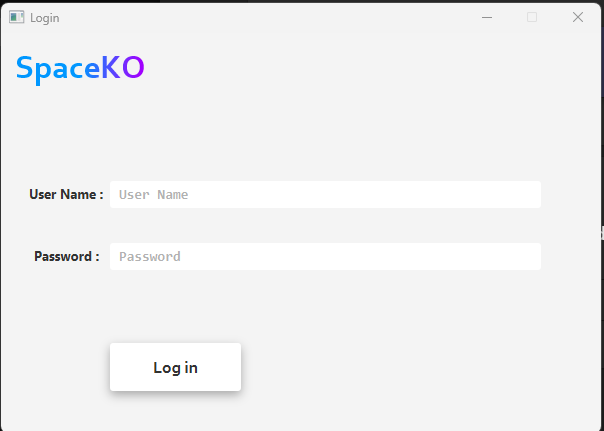

The user can then login with their username and password:

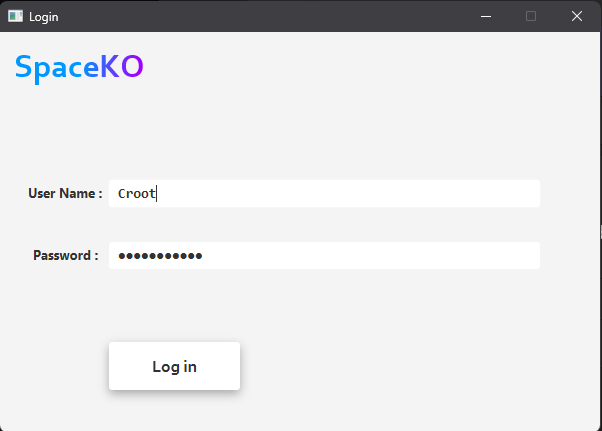

> If the entry is invalid, the console prompts as follows:
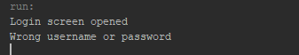

If the entry is valid, the user is then greeted with a second screen prompting him on his next step.

![Login Success]./Screenshots/(./Screenshots/image-3.png)

The user can add a new system user from the **Add System User**

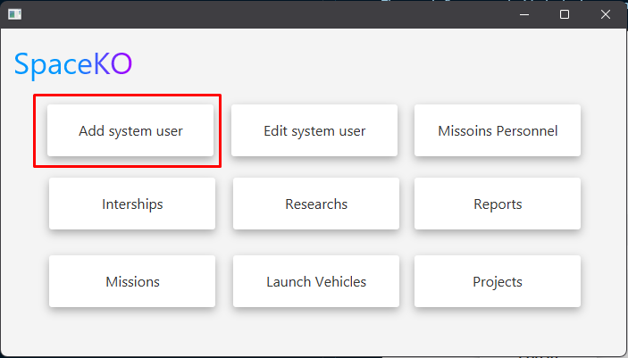

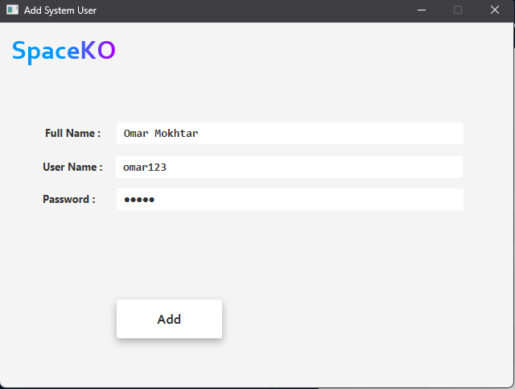

> If succedded, the console prompts you that a new user has been added. 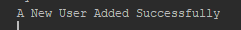

We can double check our entry by searching for our id: in this case it's 9.

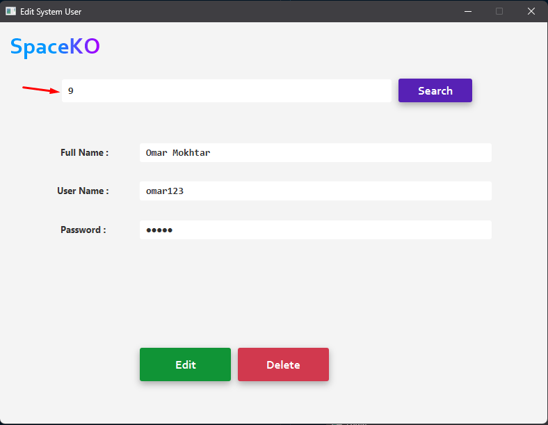

The user can delete or edit the user if desired.

The user can also view the missions by the agency's personnel:

![Alt text]./Screenshots/(./Screenshots/image-8.png)

![Alt text]./Screenshots/(./Screenshots/image-9.png)

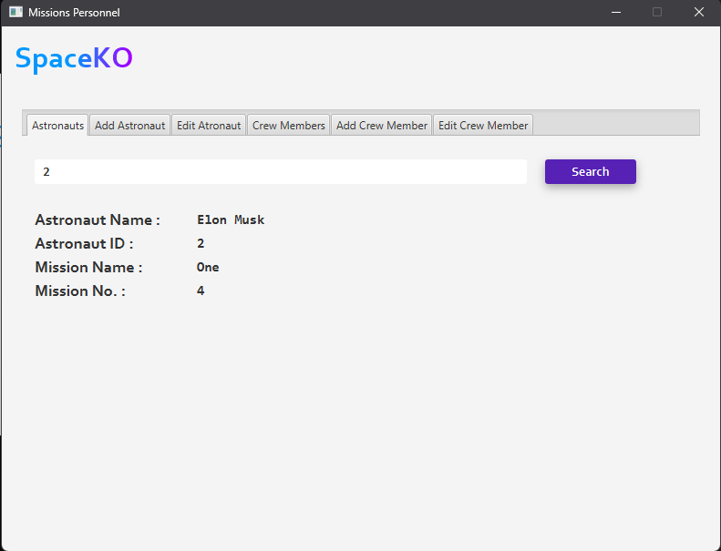

For this example we searched the astronaut of ID #2 and it showed "Elon Musk" as a result.

We can also use the other two tabs to edit & delete astronauts *Same as System user*.

We can also view Crew Members:

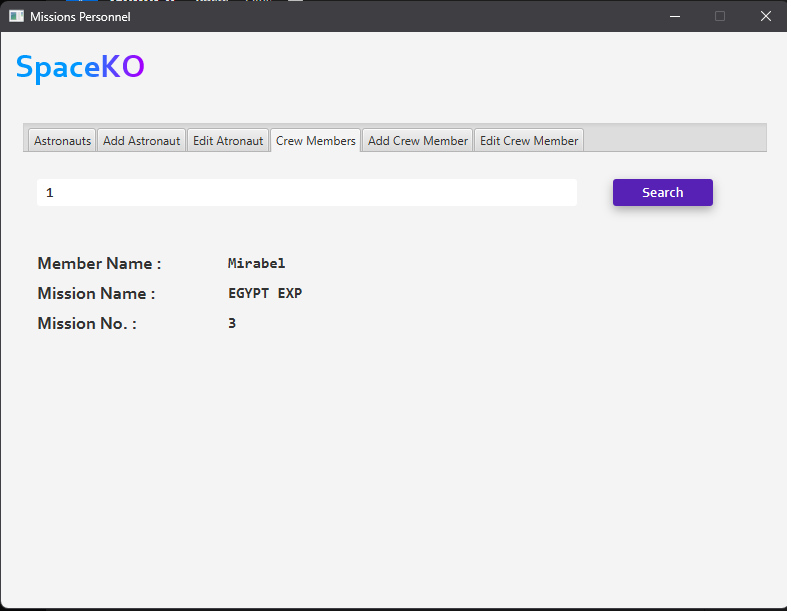

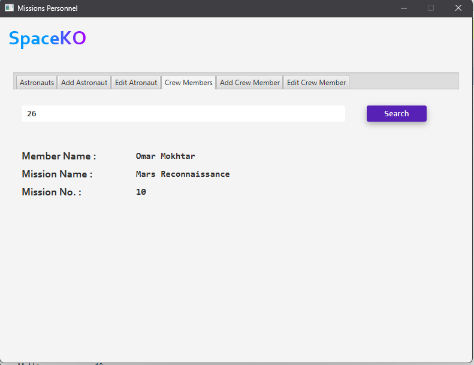

We can also search for researchers and researches

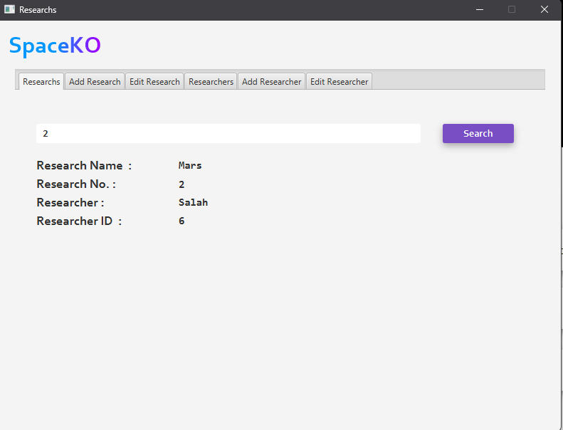

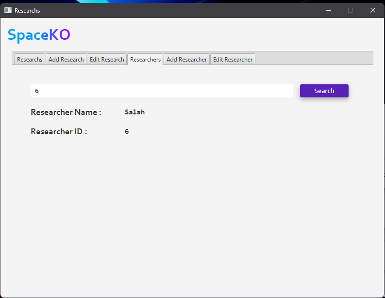

Same goes for missions:

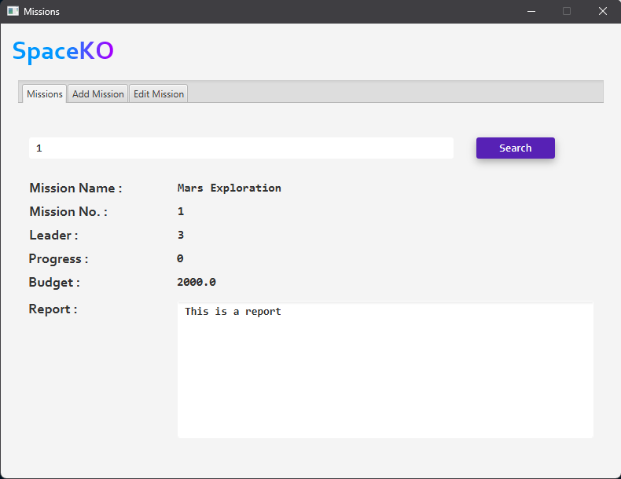

---
